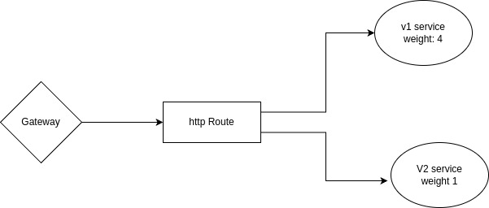

# Airport API

<!-- My thought process and decisions goes here -->

---
_For tasks, checkout [tasks.md](tasks.md)_

1. Provisioning Bucket with IaC: Using terraform IaC tool and AWS cloud for reference. I have created a **bucket** module, this module will create a bucket and attach policies to it. Initially Get, List and Put object actions will be allowed in the new bucket, for the principals given as input values. I have declared *bucket_policy_allow_principals* variable as type *list(map(any))*, so that the access can be given to multiple principals(service, AWS user, Federated users); using a dynamic block that will go through the list maps/objects and add principals to the same policy statement. Allowed field for *bucket_policy_allow_principals* objects's are:
```
{
    type: string,
    identity: string
}
```
2. endpoint /update_airport_image: I have added the endpoint with following workflow:
- first parsing the *MutipartForm* data with Post method to this endpoint. Parsed the image with key *img* and airport name with key *name*, if any field is not available then returning a 400, Bad Request response. 
- Assumed the endpoint in V2 api, so searched for the name in airportsV2 list, if not found returning 404 response.
- Then, opened a s3 client to upload the image. *I have used AWS s3 for my knowledge compatablity and shortage of time.* Using the bucket name from env var to make the app portable. I have also used the uploaded image metadata filename as the object key to upload the image in the bucket. Tried to upload the image using GO AWS SDK and if get errored then returning a 500, Internal Server Error response.
- If image upload if succeeded then updated the values in both *airports* and *airportsV2* list and returned the updated airports object.
- I have also assumed this workflow in v2 API so used the v2 scheme and datastore, just updated the legacy datastore to reflect the changes.

3. Containerize the app: I have used multistaged docker build to optimize the image to serve. Using golang-alpine image for build, copied the go.mod file first and installing the dependencies, reduing image layers when source code changes but no dependencies are updated. In the final image, copied the compiled binary, used a non priviledged user to run the app and exposing the port 8080 only from the container.

4. Kubernetes manifest:
- I have organised the manifests under the directory *manifests*. The application is dependent on env variables, for *upload_bucket_name*, *AWS access credentials*. So I created a config map for app configurations like bucket name here, and created Secret resource for sensitive AWS access credentials and mounted them as env variables in the container.
- So here is a dependency for the application deployment prcoess, before the application deployments are applied, configmap and secrets sources have to be existed. So applying the *cmandsecret.yaml* before other manifests. I want to mention, this dependencies and application deployment would be better configured with Helm packaging.
- I have created two manifests for two different versions of the app. I have used a label `version` to configure the deployment and service resource here.

5. Assuming API gateway *Kuma*, implement httpRoute resources that will use the k8s core service resources. Here is a diagram that shows the higher level dataflow for my advocated solution, here using weight to distribute the load between the services.


*Not implemented. I am not well familier with API gateway yet, no previous hands on experience regarding API gateways*

**Bonus Tasks** *(Not Implemented)*
1. As the application is multiversioned, my approach for CI/CD piepline is using different branch for different versions, I proposing a high level workflow with considering Github Action as the CI/CD.
- say *release_v1* branch tracks the v1 version, and *release_v2* branch tracks v2 version of the app
- a central repo/branch contains the action for build and deploy jobs, these workflows are configured to trigger on *workflow_dispatch* events and takes inputs to better control versioning requirments.
- workflows configured on release-* brnches trigger on push/PR close events, invokes the module workflows with their respective values.
- storing the secrets(docker repo creds, deploy creds) in Github repo/environment level secrets for security purpose. Using Environments for manual approval if it is required before deploying.
